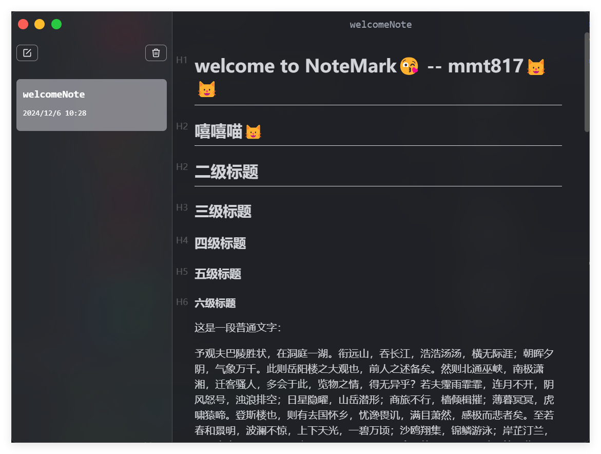

# NoteMark
具有开箱即用的 Markdown 支持的 Note Taken 桌面端应用程序, 使用 Electron 和 VUE 开发

## 项目设置
`electron-quick-start` 初始构建: `pnpm create @quick-create/electron`

项目参考: https://github.com/CodeWithGionatha-Labs/NoteMark (mac/react项目, 多数配置不适配)

Markdown 编辑器参考: https://b3log.org/vditor/

## 项目启动

### install
`pnpm install`
### dev
`pnpm dev`

## 项目展示




最大化窗口操作暂不可用, windows 设置 `backgroundMaterial` 时, 最大化 electron 将失去窗口圆角及样式, 待官方修复

issues: https://github.com/electron/electron/issues/41073

---
## 项目打包
`pnpm build`

### build
```bash
# For windows
pnpm build:win

# For macOS
pnpm build:mac

# For Linux
pnpm build:linux
```
当前 `pnpm start` 即 `pnpm electron-vite preview` 启动项目页面为空, 暂未解决, dev 模式下可正常启动
